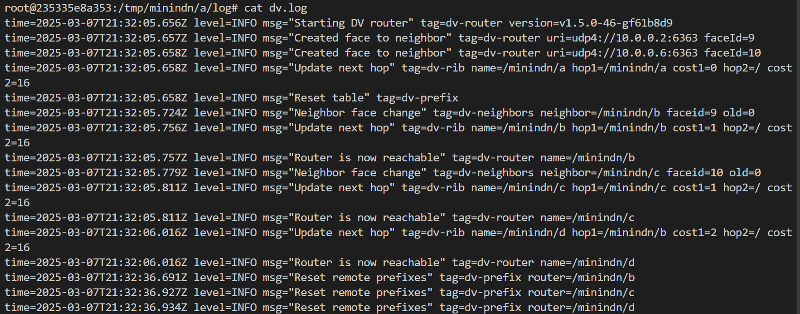
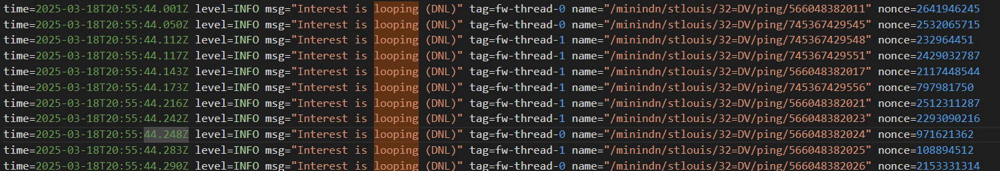

# Codebase

**ndnd** https://github.com/named-data/ndnd

**mini-ndn** https://github.com/named-data/mini-ndn

# Step 1: Docker, Go, Environment

https://minindn.memphis.edu/install.html#using-docker

```
# Use the nightly build from GitHub package registry (for first time)

docker run -m 4g --cpus=4 -it --privileged \
        -v /lib/modules:/lib/modules \
        ghcr.io/named-data/mini-ndn:master bash

# Copy files in container to host (if host to container, swap paths)

docker cp <container_name>:/<container_folder_path> <local_folder_path>

# Start or stop an existing container

docker start|stop <container_name>

# Open a shell inside a running container...

docker exec -it <container_name> sh
```
-  To go to our working environment, use `docker exec -it practical_nash bash`

-  To copy remote working file into the docker, use `docker cp /home/dvtest/eval-ndn-dv practical_nash:/mini-ndn`

## Verify the container is working

Refer to https://minindn.memphis.edu/install.html

## Installing go in container

-  To setup Node.js(>20) encironment, use `export PATH=$PATH:/mini-ndn/go/bin`

-  Let ndnd be ready, run `make` and `make install` in ndnd folder.

# Step 2: Setting up the network with real-life topology

## Task 1 - What we have done

1. Replace DV config and forwarder with `dv_ndnd.py` and `fw_ndnd.py`

2. Trust alignmenet: Added `NDNd_DV.init_trust()` in `dv_ndnd.py` to initialize trust.

3. Code optimization: `time.sleep`, file paths, prefix change to `/minindn/{target.name}/32=DV/ping` in `scenario.py`.

4. 100% Loss (indicating NDN-DV is not establishing any form of connection): Change the ping server to start after starting the DV router `ping_servers = AppManager(ndn, ndn.net.hosts, PingServer)`, previously it was started before.

5. **Unusual High losses**: Try the following: (a) Pull the latest repo branch of NDNd. (b) Change the 32=DV prefix to something else (for both ping and pingserver). Say `32=PING`. (c) In pingserver, use `ndnd pingserver --expose <prefix>` instead of using `ndnpingserver`. The --expose flag will then explicitly announce the prefix to the routing system (you need the HEAD of repo branch for this, this flag is very recent).

6. Docker resource constraints: Init with 4 CPU cores and 4G memory. `docker update --cpus=64 --memory-swap=128g --memory=128g practical_nash` enlarges to 64 CPU cores and 128G memory.

## Task 2 - What we have done

1. Measure the number of interests that were dropped due to loop. We detect loop in the forwarder at two points: Line 237-246 at ndnd/fw/fw/thread.go. So the first step should be as simple as increasing the log level here, then count the number of times the loop is logged in the forwarder logs. Change `core.Log.Debug` to `core.Log.Info` in drop packet if no nonce is found and check if packet is in dead nounce list.

2. In `scenario.py` count the # of "Interest is Looping", calculate the LOOP percentage.

3. Set `DRY=True` at the top of `scenario.py`. This is the loss caused by network partitions and you can subtract it from your measured loss values

4. Show further insight after setting the link delay to 100ms for each link in the sprint topology.


## To start up experiment

-  To run testing evaluations, run `python ./eval-ndn-dv/scenario.py`

-  To scale up with `sprint.conf` topology, run `python ./eval-ndn-dv/scenario.py sprint.conf`. Check this visualization in play-ndn website. This topology has a total of 52 nodes and 84 links.

-  If the python script has been stopped by Ctrl+C, kill all the processes. Run `pkill -9 ndnd` and `pkill -9 -f ping` to kill the minindn process.

## Examining the logs and results

In `/tmp/minindn/a/log`, we have `dv.log`, which shows the router convergence.



`pingserver.log` Server log. When server receives a interest packet, we note is sequence number.

`yanfd.log` Forwarder log. Routing talking to the neighbours. This is the log we want to look at for looping.



`ping-c.log`: (here c is the server) Client log. When we have a mutual response (bidirectional flow), log ".", when we have a one-directional flow, log "x". Loss is computed by one-direction / total.

# Step 3: Interpreting the loss

To evaluate convergence speed under packet looping scenario. We are mainly interested in loss - a indicator of total convergence. Relative loss on different settings (using same realistic topology). We are also interested in looping (and dropped) Interests.

Logs are in `eval-ndn-dv/results` as file names are `dv_base_{seed}_{mttf}_{mttr}`

## Hyperparements tuning

Variables: **NUM_PINGS, MTTR, MTTF.** Observation: Loss. Linear / exponenetial plots.

In `ndnd/dv/config/config.go`, we set `AdvertisementSyncInterval_ms = 1000 (>= 1000), RouterDeadInterval_ms = 3000. (> 2* Adverstisement...)`. This two variables are not much of a concern than the previous thress .But if the config is changed, run `make` and `make install` again. 